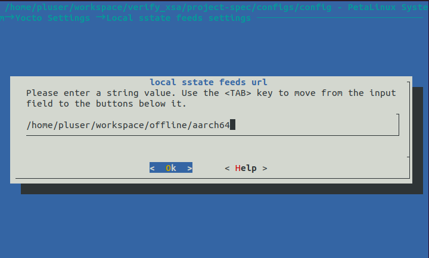
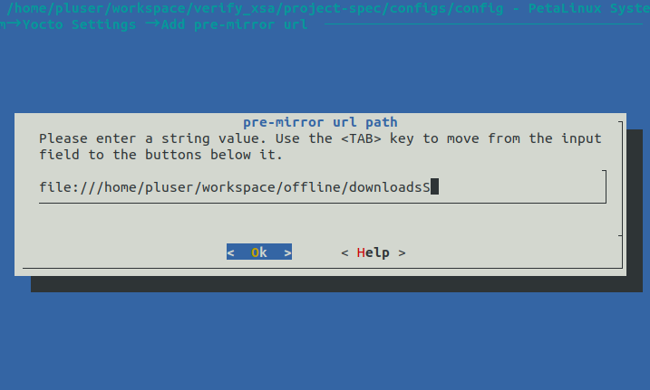
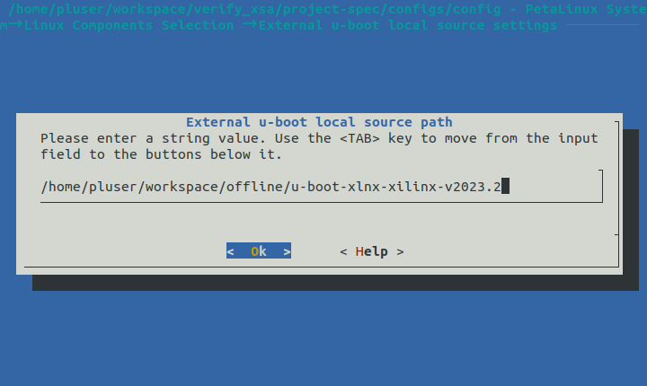
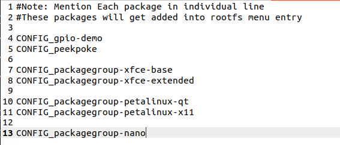
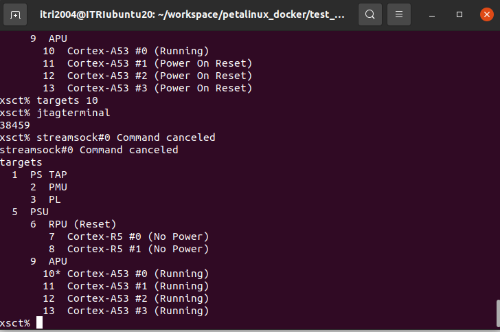

## 測試
下載pre-build [image](https://www.96boards.org/documentation/consumer/ultra96/ultra96-v2/downloads/linux.md.html)

## 事前準備
1. 安裝docker ubuntu22.04
```
docker build \
  --build-arg USER_UID=$(id -u) \
  --build-arg USER_GID=$(id -g) \
  -t my-petalinux:20.04 .
```

```
docker run -it \
  --name petalinux_lab \
  -v /home/itri2004/workspace/petalinux_docker:/home/pluser/workspace \
  -w /home/pluser/workspace \
  my-petalinux:20.04
```
2. petalinux 2024.2
3. 下載sstate ＆ download (amd download embedded software) [link](https://www.xilinx.com/support/download/index.html/content/xilinx/en/downloadNav/embedded-design-tools.html)

4. 下載bsp [link](https://www.avnet.com/americas/products/avnet-boards/avnet-board-families/ultra96-v2/)
5. 下載[u-boot](https://github.com/Xilinx/u-boot-xlnx/) [linux-kernel-src](https://github.com/Xilinx/linux-xlnx)
### 在docker中安裝petalinux
```
chmod +x petalinux-v2024.2-final-installer.run
./petalinux-v20xx.xx-final-installer.run --dir ./tools

source /tools/settings.sh
```
### 進出docker
```
docker ps -a

docker start <container_name>

docker exec -it <container_name> bash

source /home/pluser/petalinux/settings.sh
```

### build project

petalinux-create -t project -s <bsp_file> -n test_project

- 官方BSP貌似有問題 解法事先create bsp_project再從hardware找出xsa檔案 再重新build一次

petalinux-create -t project -n <projectName> --template zynqMP

### petalinux-config
petalinux-config --get-hw-description <.xsa path>
- xsa在project hardware中
### config 離線包路徑
- aarch64
→ Yocto Settings → Local sstate feeds settings
`/home/pluser/workspace/offline/aarch64`

- downloads
→ Yocto Settings → Add pre-mirror url
`/home/pluser/workspace/offline/dowloads`

- u-boot
→ Linux Components Selection → u-boot → ext-local-src [*]
→ Linux Components Selection → External u-boot local source settings


- Linux-kernel-Src
→ Linux Components Selection → linux-kernel → ext-local-src[*]
→ Linux Components Selection → External linux-kernel local source settings


## 安裝套件
在`project-spec/meta-user/conf/user-rootfsconfig`中加入
CONFIG_packagegroup-petalinux-qt
CONFIG_packagegroup-petalinux-x11

### dtsi setting
在`project-spec/meta-user/recipes-bsp/device-tree/files/system-user.dtsi`中加入
```
/include/ "system-conf.dtsi"
&sdhci0 { /* FIXME - on CC - MIO 39 - 51 */
    	status = "okay";
    	no-1-8-v;
    	disable-wp;
    	broken-cd;
    	xlnx,mio-bank = <1>;
    	/* Do not run SD in HS mode from bootloader */
    	sdhci-caps-mask = <0 0x200000>;
    	sdhci-caps = <0 0>;
    	max-frequency = <19000000>;
    	/delete-property/ wp-gpios;
    };
```
U1以上的sd卡必須要降速 並且預設會把sd卡設定成read only 所以必須加上設定
### 開始build
petalinux-build 2>&1 | tee build.log
petalinux-package --boot --u-boot --fpga --force


## 燒錄
```
取消掛載
sudo umount /dev/sda1
sudo umount /dev/sda2
格式化
sudo mkfs.vfat -F 32 -n BOOT /dev/sda1
建立掛載點
sudo mkdir -p /mnt/sd_boot
sudo mount /dev/sda1 /mnt/sd_boot
複製image
cd ~/work/test_project/images/linux/
sudo cp BOOT.BIN boot.scr image.ub /mnt/sd_boot/
檢查並卸載
ls /mnt/sd_boot/  # 確認有看到三個檔案
sudo umount /mnt/sd_boot
燒錄
sudo umount /dev/sda2
sudo dd if=rootfs.ext4 of=/dev/sda2 bs=4M status=progress
sync
```
## 清除build
```
petalinux-build -x mrproper //部份清除

petalinux-build -x distclean //完全清除
```
或是直接刪掉
```
rm -rf build/
rm -rf components/
```
完成後必須
```
petalinux-config
```


## xsct (檢查硬體用)
source /tools/Xilinx/Vitis/2023.2/settings64.sh

xsct

connect

targets



## bsp xsa

bsp -> 幫你功能開好 沒有bsp照樣能開只是功能需要自己加 (官方bsp有誤 燒不進去)

xsa -> vivado產生 利用petalinux-config設定 並build 純xsa是沒有任何功能需要開啟kernel設定

ps->Linux端

pl->FPGA

## 曾經遇過得幾個錯誤

- 亂碼
檢查電源是否不夠
- 讀不到SD卡(error -110)
檢查SD卡是否為High Speed Mode
- kernel panic(error 30)
SD卡變成ro 所以kernel無法修改

itri2004@ITRIubuntu20:~$ git clone https://code.qt.io/qt-creator/qt-creator.git
Cloning into 'qt-creator'...
fatal: unable to access 'https://code.qt.io/qt-creator/qt-creator.git/': GnuTLS recv error (-110): The TLS connection was non-properly terminated.